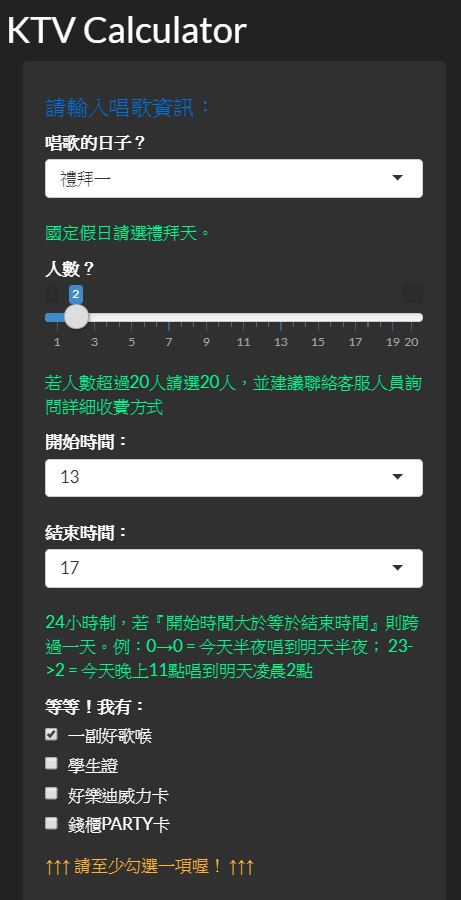

# KTVcalculator

[KTVcalculator](https://evanyo25.github.io/dPD_ktv/select.html) is a tool for selecting appropriate [Karaoke box (or KTV)](https://en.wikipedia.org/wiki/Karaoke_box) in Taipei, Taiwan.

This is one of the gadgets in the KTV information platform: [KTV in Taipei](https://evanyo25.github.io/dPD_ktv/index.html), a term project of a course "Applications for Computer Programming", National Taiwan University (NTU).

    Please forgive my typo of the name of this repository.
    The typo is left unfixed to run the platform (KTV in Taipei) which is held by my collaborator.

User story:
----

* There are two common kinds of charging standards of KTV: 
  * **Counting Noses**
  * **Box**
* The charge in the morning often differs from that in the afternoon / at night and / late at night.
* Various discounting rates and coupons exist.
* Given the charging standards and entertaining features of KTVs are intricate and confusing in Taipei, a transparent a multifunction platform is needed.

Codes:
----

The calculator is based on Shiny, an R package for interactive web apps.

To see more details, check [here](https://shiny.rstudio.com/).

Guide line:
----
For now, KTVcalculator supports Chinsese only.

### Index page

### Control bar

    Enter the information here.
    Choose the weekday, the number of people, the time period, and coupon options.

### Charge computation

    Switch the tab page from HEAD to BOX to check the best price of your entertainment.
    Please refer to those hints below the forms. The recommendation form of box sizes is shown in the BOX tab page.

### info

    After finding the store you prefer, quick reservasion is availabe here. 
    Its map location can be seen on other page of the platform.
    Enjoy the stage!
    
